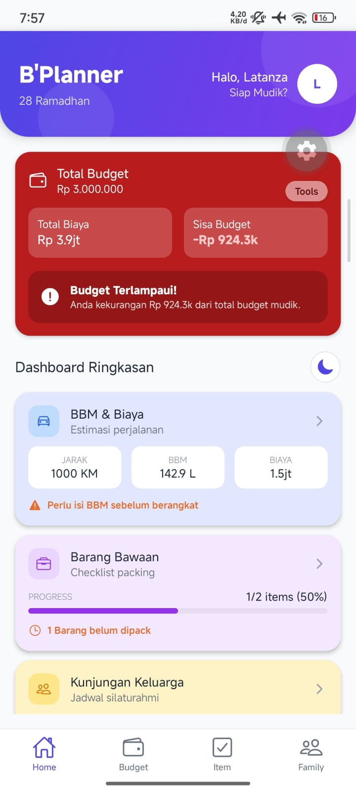
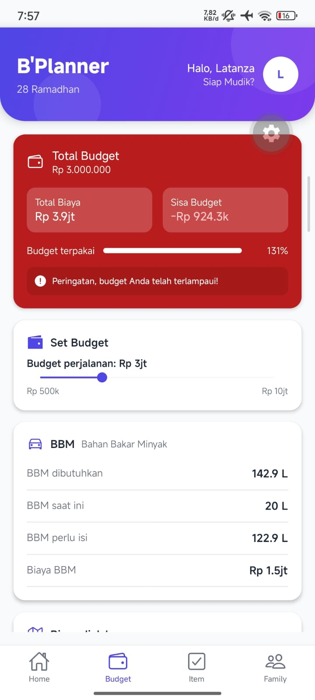
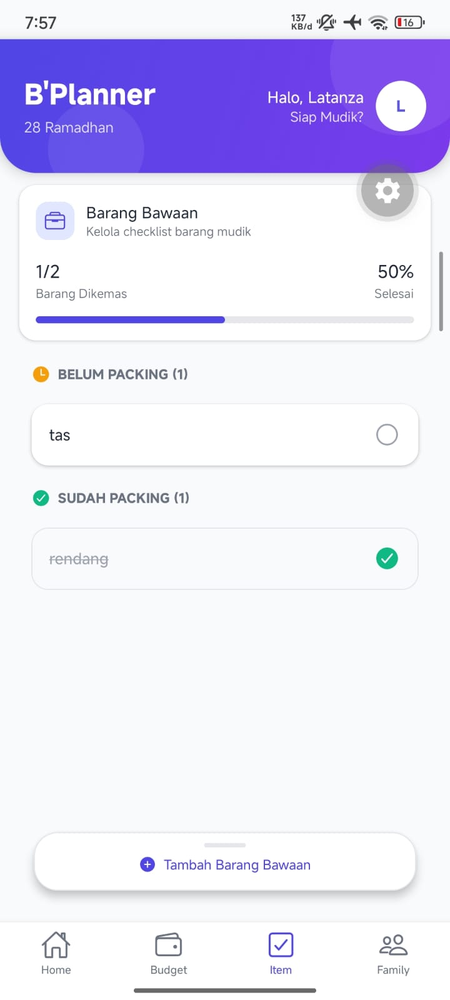
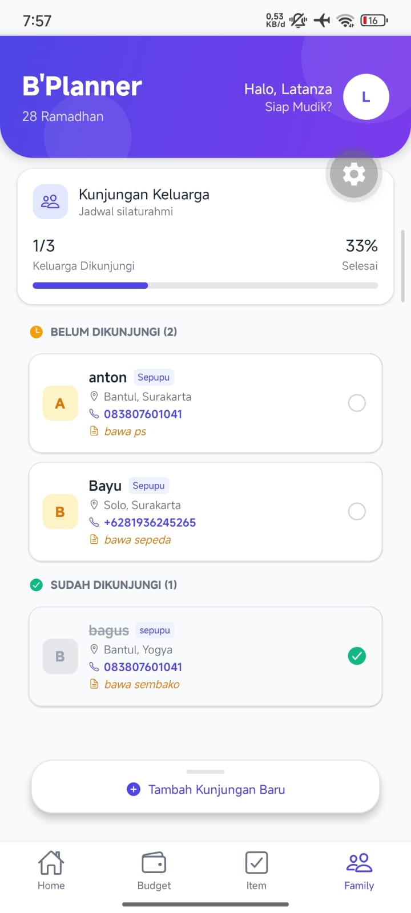

# B'Planner App - THR Minggu 4 State Management

## Informasi Mahasiswa

- Nama : Latanza Akbar Fadilah
- NIM : 2410501004
- Opsi : C - Mudik Planner App

## Deskripsi Aplikasi

**B'Planner (Mudik Planner App)** adalah aplikasi mobile berbasis **React Native (Expo)** yang dirancang khusus untuk membantu pengguna merencanakan perjalanan mudik (pulang kampung). Aplikasi ini mempermudah pengguna dalam mengatur estimasi biaya (budget perjalanan & BBM), mencatat checklist barang bawaan (packing list), dan memantau jadwal silaturahmi keluarga agar perjalanan lebih terencana. Aplikasi ini juga dilengkapi dengan fitur mode gelap (dark mode) dan dashboard interaktif yang memvisualisasikan progres persiapan mudik.

## Hooks yang Digunakan

Aplikasi ini menggunakan berbagai hooks bawaan React maupun custom hooks untuk mengelola state secara efisien:

- **useState** : Digunakan untuk mengelola state lokal UI, seperti mengontrol visibilitas modal konfirmasi reset (`HomeScreen`), form input data keluarga (`FamilyScreen`), dan state temporary slider (`BudgetScreen`).
- **useEffect** : Digunakan pada `BudgetScreen` untuk mensinkronisasi perubahan nilai antar komponen secara real-time dan untuk memicu (_trigger_) munculnya notifikasi saat estimasi biaya telah melampaui _budget_ yang ditetapkan.
- **useReducer** : Digunakan di balik _Context API_ untuk mengelola _state management_ global yang lebih kompleks. Action types yang digunakan antara lain:
    - `SET_BUDGET`, `SET_DISTANCE`, `SET_FUEL`, `RESET_BUDGET`, dll. (Manajemen Budget)
    - `ADD_FAMILY`, `DELETE_FAMILY`, `TOGGLE_VISIT`, `RESET_VISITS` (Kunjungan Keluarga)
    - `RESET_PACKING` (Barang Bawaan)
- **Custom Hook** :
    - `useBudget`, `usePackingList`, `useVisits`: Untuk memisahkan logika reducer dan context (pemanggilan state global) dari komponen UI sehingga kode lebih bersih.
    - `useTheme`: Mengelola state Dark/Light mode di seluruh aplikasi.
    - `useRotation`: Membungkus logika animasi `react-native-reanimated` agar modular dan bisa dipakai ulang.

## Screenshot

<div style="display: flex; flex-direction: row; gap: 10px;">
  
  
  
  
</div>

## Cara Menjalankan

Langkah menjalankan project:

```bash
npm install
npx expo start
```

- Gunakan aplikasi **Expo Go** di perangkat Android atau iOS untuk memindai QR Code yang muncul di terminal.
- Tekan `a` di terminal untuk menjalankan di Android Emulator.
- Tekan `i` di terminal untuk menjalankan di iOS Simulator.

## Poin Bonus Tambahan

Berikut adalah beberapa poin bonus dari tantangan yang telah berhasil diimplementasikan dalam aplikasi ini:

### Tantangan Bonus

- **Dark Mode menggunakan Context API terpisah (ThemeContext)**: Aplikasi sepenuhnya mendukung mode gelap dan terang. State dikelola dalam file `theme.context.js` dan diakses melalui custom hook `useTheme`.
- **Visualisasi data (chart atau progress bar) dengan animasi**: Terdapat komponen progress bar untuk memvisualisasikan data sisa _budget_ (termasuk persentase), progress daftar _packing_, dan progress keluarga yang sudah dikunjungi di halaman Dashboard.
- **UI/UX yang sangat polished dengan animasi menggunakan Reanimated**: Menggunakan _React Native Reanimated_ untuk menciptakan pengalaman pengguna yang lebih hidup. Dibuat sebuah _custom hook_ `useRotation` yang membungkus logika `useSharedValue` dan `withSpring` untuk membuat animasi rotasi yang modular. Hook ini kemudian diterapkan pada tombol _toggle theme_ dan komponen peringatan (notice) saat budget terlampaui, memberikan efek rotasi yang interaktif dan konsisten di seluruh aplikasi.
- **Unit testing pada custom hooks menggunakan Jest**: Logika kalkulasi total biaya perjalanan dan validasi status _over-budget_ (_budget limit_) telah diuji menggunakan Jest pada file `__tests__/budget.test.js`.
